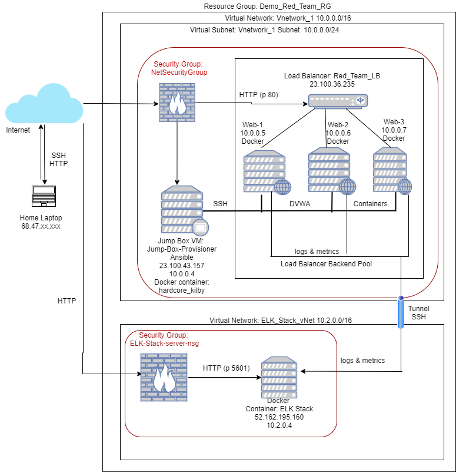

# Automated ELK Stack Deployment

The files in this repository were used to configure the network depicted below.

These files have been tested and used to generate a live ELK deployment on Azure. They can be used to recreate the entire deployment pictured above. Alternatively, select portions of the Ansible Playbook files may be used to install only certain pieces of it, such as Filebeat.

  - pentest.yml
  - install-elk.yml
  - filebeat-config.yml
  - metricbeat-config.yml
  - hosts

This document contains the following details:
- Description of the Topology
- Access Policies
- ELK Configuration
  - Beats in Use
  - Machines Being Monitored
- How to Use the Ansible Build
- Investigation using Kibana

### Description of the Topology

The main purpose of this network is to expose a load-balanced and monitored instance of DVWA, the D*mn Vulnerable Web Application.

Load balancing ensures that the application will be highly available, in addition to restricting inbound access to the network.
- A Load Balancer protects the availability of resources, and mitigates Denial of Service (DoS) attacks. It monitors the health of the 
servers and distributes incoming traffic so that no server has to handle too much traffic. The advantage of a jump box is to restrict 
access to the servers to a single point that can be monitored and controlled.

Integrating an ELK server allows users to easily monitor the vulnerable VMs for changes to the file system and system logs.
- Filebeat collects data about the file system.
- Metricbeats collects machine metrics, such as uptime.

The configuration details of each machine may be found below.

| Name      | Function      | Private/Public IP Address | Operating System |
|--------- -|----------|------------|------------------|
| Jump Box  | Gateway        | 10.0.0.4/23.100.43.57   | Linux            |
| Web-1     |DVWA Web Server| 10.0.0.5                | Linux            |
| Web-2     |DVWA Web Server| 10.0.0.6                | Linux            |
| Web-3     |DVWA Web Server| 10.0.0.7                | Linux            |
| ELK       |Monitor        | 10.2.0.4/52.162.195.160 | Linux            |

### Access Policies

The machines on the internal network are not exposed to the public Internet. 

Only the Jump Box Provisioner Machine can accept connections from the Internet. Access to this machine is only allowed from the following IP addresses:
- 68.47.76.17

Machines within the network can only be accessed by SSH connection from the Jump Box Provisioner Machine.
- The ELK Server can only accept SSH connections from the Jump Box Provisioner Machine, with an IP address of 10.0.0.4. The Kibana Web page can be accessed 
only by the following addresses via HTTP over port 5601.
- 68.47.76.17

A summary of the access policies in place can be found in the table below.

| Name     | Publicly Accessible | Allowed IP Addresses |
|----------|---------------------|----------------------|
| Jump Box | Yes                 | 68.47.76.17          |
| ELK Stack| Yes -Kibana Webpage | 68.47.76.17          |
| ELK Stack| No -SSH             | None
|Web-1| No|None|
|Web-2| No|None|
|Web-3| No|None|

### Elk Configuration

Ansible was used to automate configuration of the ELK machine. No configuration was performed manually, which is advantageous because:
- It drastically reduces the potential for human error.
- It simplifies the process of creating identical machines.

The playbook implements the following tasks:
- Configures the virtual machine to use more memory.
- Installs apt packages docker.io which is the Docker engine; and python3-pip which is the package used to install Python software.
- Installs pip package docker, the Python client for Docker.
- Downloads the Docker container called sebp/elk:761
- Configures the container to start with port mappings 5601:5601, 9200:9200, and 5044:5044.
- Starts the container and enables the docker service on boot.

The following screenshot displays the result of running `docker ps` after successfully configuring the ELK instance.

(Diagrams/ELK_container_screenshot.png)

### Target Machines & Beats
This ELK server is configured to monitor the following machines:
- 10.0.0.5
- 10.0.0.6
- 10.0.0.7

The following Beats have been installed on these machines:
- Filebeats
- Metricbeats

These Beats allow collection of the following information from each machine:
- Filebeat monitors and collects log files, which contain information about accesses to the the web servers such as the IP addresses of visitors. 
- Metricbeats provides system-level monitoring for system data such as cpu usage, memory, and file system statistics.

### Using the Playbook
In order to use the playbook, you will need to have an Ansible control node already configured. Assuming you have such a control node provisioned: 
 
SSH into the control node and follow the steps below:
- To set up the DVWA servers:
  - Copy the pentest.yml file to /etc/ansible/ folder.
  - Update the /etc/ansible/hosts file to list the webservers IP addresses. Specify Python3 by adding ansible_python_interpreter=/usr/bin/python3 after the IP address.
  - Run the playbook with the following command: ansible-playbook pentest.yml
- To set up the ELK server:
  - Copy the install-elk.yml file to /etc/ansible/ folder.
  - Update the /etc/ansible/hosts file to include an elk group with the IP address of the ELK VM. Specify Python3 by adding ansible_python_interpreter=/usr/bin/python3 after the IP address.
  - Run the playbook with the following command: ansible-playbook install-elk.yml
- Navigate to http://[external_IP_address_of_ELK_Server]:5601/app/kibana to check that the installation worked as expected. For this instance http://52.62.195.160:5601/app/kibana.

### Investigation using Kibana
The ELK system was tested by "attacking" the DVWA servers and seeing the representation of the "attack" in Kibana. Three types of attacks were performed:
- SSH Barrage
- Linux Stress
- DoS

The SSH Barrage test was performed by attempting to establish an SSH connection from the Jump Box directly to one of the Web servers. This SSH connection won't be allowed because it is coming from the Jump Box and not the Docker container on the Jump Box.
Using the following command, 1000 SSH login attempts were generated: for i in {1..1000}; do ssh azureuser@10.0.0.5; done.
The failed ssh logs were observed in Kibana.

A Linux stress test was performed by connecting via SSH from the container on the Jump Box to Web-2. Then using the command sudo apt install stress, to install the stress program.
Then the stress program was run by using the command sudo stress --cpu 1. After a few minutes, the command cntrl q (to quit) was used to stop the stress. The CPU usage graph in Kibana depicted the increase in CPU.

The DoS attack was performed by using the wget command. From the Jump Box (but not in the Docker container), the following command was run to generate 1000 web requests: for i in {1..1000}; do wget 10.0.0.5; done
Spikes were observed in the load and network traffic graphs in Kibana.
